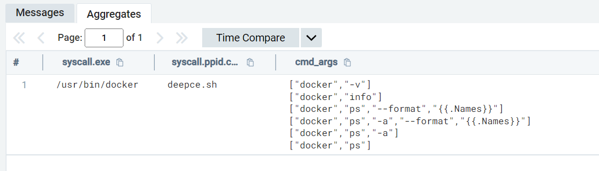
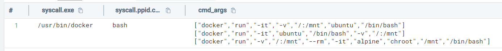
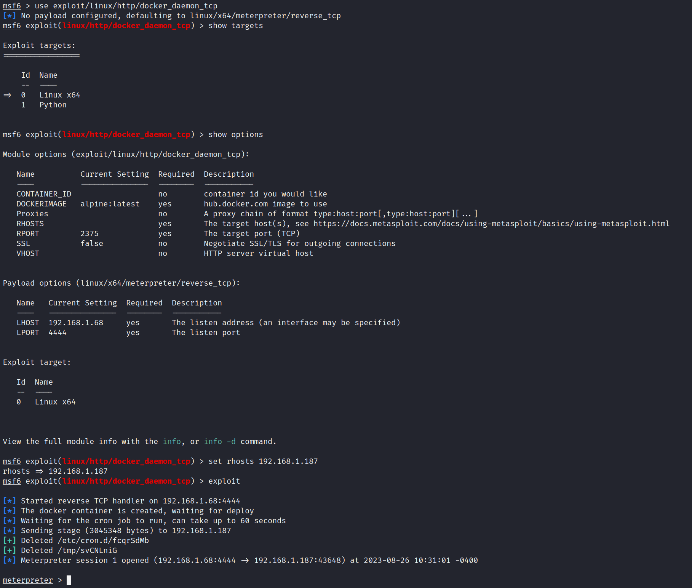

# Docker Detection Notes
##### Warning - Experimental / all done in lab environment, please test before using any of this in production

## Data Sources

- Sumo Logic Docker Driver - https://github.com/SumoLogic/sumologic-docker-logging-driver
- Laurel - https://github.com/threathunters-io/laurel
- Florian Roth's Auditd Configuration - https://github.com/Neo23x0/auditd
- Malcolm for PCAP - https://malcolm.fyi/

## References

- https://lobster1234.github.io/2019/04/05/docker-socket-file-for-ipc/
- https://github.com/cdk-team/CDK
- https://www.rapid7.com/db/modules/exploit/linux/http/docker_daemon_tcp/
- https://www.bordergate.co.uk/docker-penetration-testing/
- https://book.hacktricks.xyz/network-services-pentesting/2375-pentesting-docker
- https://github.com/stealthcopter/deepce

## TTPs

### Docker Enumeration 


```sql
_source="Laurel" 
| where %"syscall.exe" = "/usr/bin/docker"
| where _raw matches /(docker|ps|info)/
| json field=_raw "PROCTITLE.ARGV[*]" as cmd_arg
| values(cmd_arg) as cmd_args by %"syscall.exe",%"syscall.ppid.comm"
```



### Suspicious Container Start


```sql
_source="Laurel" 
| where _raw matches /(chroot|mount)/
| where %"syscall.exe" = "/usr/bin/dockerd" OR %"syscall.exe"= "/usr/bin/docker"
| json field=_raw "PROCTITLE.ARGV[*]" as cmd_arg
| values(cmd_arg) as cmd_args by %"syscall.exe",%"syscall.ppid.comm"
```


### Docker Filesystem Enumeration within Container

- Note this utilizes the Docker driver


```sql
_source="Docker" and _collector="Docker"
| if(_raw matches /mount|fdisk/,1,0) as file_system_container_commands
| where file_system_container_commands = 1
```


### Privileged Container Started


```sql
_source="Laurel" 
| where _raw matches /(privileged)/
| where %"syscall.exe" = "/usr/bin/dockerd" OR %"syscall.exe"= "/usr/bin/docker"
| json field=_raw "PROCTITLE.ARGV[*]" as cmd_arg
| values(cmd_arg) as cmd_args by %"syscall.exe",%"syscall.ppid.comm"
```


### Container Started with SYS_ADMIN privs


```sql
_source="Laurel" 
| where _raw matches /(SYS_ADMIN)/
| where %"syscall.exe" = "/usr/bin/dockerd" OR %"syscall.exe"= "/usr/bin/docker"
| json field=_raw "PROCTITLE.ARGV[*]" as cmd_arg
| values(cmd_arg) as cmd_args by %"syscall.exe",%"syscall.ppid.comm"
```


### Overly Permissive Mount


```sql
_source="Laurel" 
| where _raw matches /(\-v\"\,"\/\:\/mnt)/
| where %"syscall.exe" = "/usr/bin/dockerd" OR %"syscall.exe"= "/usr/bin/docker"
| where %"syscall.ppid.comm" = "bash"
| json field=_raw "PROCTITLE.ARGV[*]" as cmd_arg
| values(cmd_arg) as cmd_args by %"syscall.exe",%"syscall.ppid.comm"
```



```sql
_source="Docker" and _collector="Docker"
| where _raw matches /(cat.\/mnt\/etc\/)/
```


### Docker Daemon - Unprotected TCP Socket Exploit



```sql
_source="Laurel" 
| where %"syscall.key" = "network_socket_created"
| where %"syscall.exe" matches /(\/tmp\/\w\w\w\w\w\w\w\w)/
| values(%"proctitle.argv") as args by %"syscall.exe"
```


```sql
_source="Laurel" 
| json field=_raw "PROCTITLE.ARGV[*]" as cmd_arg
| %"path[0].name" as path_name
| where %"syscall.ppid.exe" = "/usr/bin/containerd-shim-runc-v2"
| where path_name matches /(cron\.d)/
| values (path_name) by cmd_arg
```


